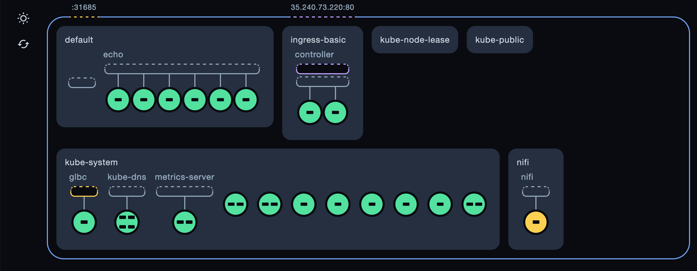
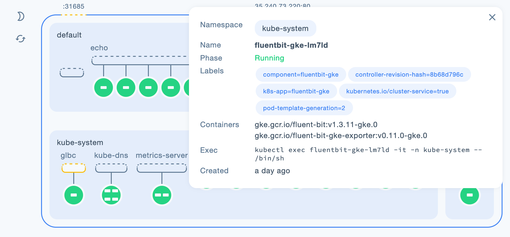

# KUVI : Kubernetes Visualizer

Kuvi is a web-based visualization tool for your Kubernetes clusters. It automatically links Namespaces, Services and Pods to help you better understand what is inside your cluster.




# Getting Started

### Prerequisites

- A running Kubernetes cluster with version 1.15.0 or later. (e.g. [minikube](https://github.com/kubernetes/minikube))
- A kubeconfig file configured in ~/.kube/config to connect to the cluster. If you are using minikube, for example, you can run `kubectl config set-context minikube` to get ~/.kube/config set up correctly.

## Development / Running Kuvi locally

**NOTE:**
Node.js should be installed

1. Clone this repository

```
git clone https://github.com/vctrmn/kuvi.git
```

```
cd kuvi
```

2. Install dependecies and start the application

```
npm install
```

```
npm run dev
```

3. Browse [http://localhost:3000](http://localhost:3000)

## Deploying Kuvi on Kubernetes

**NOTE:**
Never trust a file downloaded from the internet. Make sure to review the contents of [kubernetes.yaml](https://github.com/vctrmn/kuvi/blob/main/kubernetes.yaml) before running the script below.

1. Run the following command to install kuvi and its dependencies:

```
kubectl apply --filename https://raw.githubusercontent.com/vctrmn/kuvi/main/kubernetes.yaml
```

2. Access the dashboard using kubectl port-forward

```
kubectl --namespace kuvi port-forward svc/kuvi-dashboard 9876:80
```

3. Browse [http://localhost:9876](http://localhost:9876) to access your Dashboard.

### Clean up

```
kubectl delete --filename https://raw.githubusercontent.com/vctrmn/kuvi/main/kubernetes.yaml --ignore-not-found
```

## Built With

- [React](https://github.com/facebook/react)
- [Redux](https://github.com/reduxjs/redux)
- [Express](https://github.com/expressjs/express)

## Authors

- **[Victor Moin](https://www.linkedin.com/in/victor-moin/)**

## License

[GPL-3.0](LICENSE)
